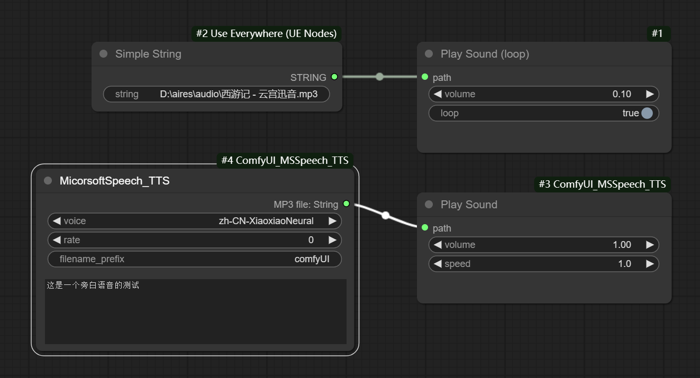
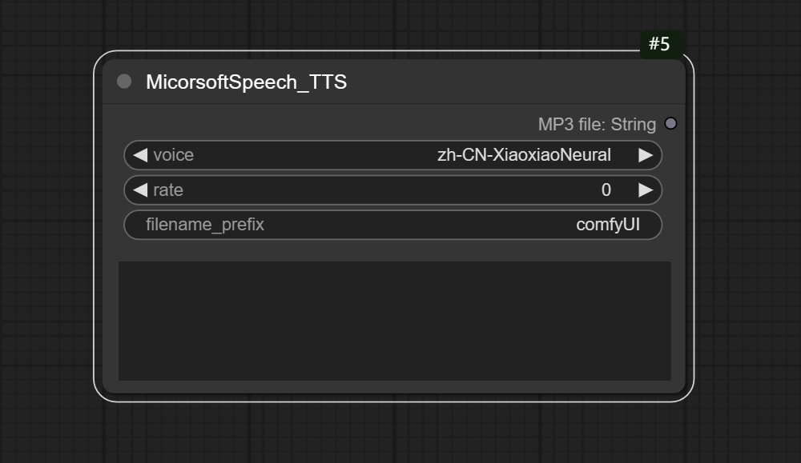

## 增加节点：
### Play Sound 
选项：音量和语速调节，音量调整范围0-1，语速调整范围0.1-2。这个节点支持多线程播放。  
### Play Sound(loop)
选项：音量调节和循环选项，音量调整范围0-1。这个节点始终占一个声音播放线程。  

 (由于引入了新的节点，请重新安装依赖包)   



# ComfyUI_MSSpeech_TTS  
ComfyUI下使用的文本转语音插件。使用Microsoft speech TTS 接口将文本内容转为MP3格式的语音文件。  



### 插件调整项：  
**voice:** 语音种类。   
**rate：** 语音速度。默认是0，调整范围从-200到200。数字越大速度越快。  
**filename_prefix:**  文件名前缀。   

### 输出： 
MP3 File,字符串类型，其内容是语音文件地址。

## 安装方法：  
- 解压zip文件，将"ComfyUI_MSSpeech_TTS"文件夹复制到 ComfyUI\custom_nodes\
- 安装依赖包，在资源管理器ComfyUI\custom_nodes\ComfyUI_MSSpeech_TTS\ 这个位置打开cmd窗口，输入以下命令：  
```..\..\..\python_embeded\python.exe -s -m pip install -r requirements.txt```
- 重新打开ComfyUI
