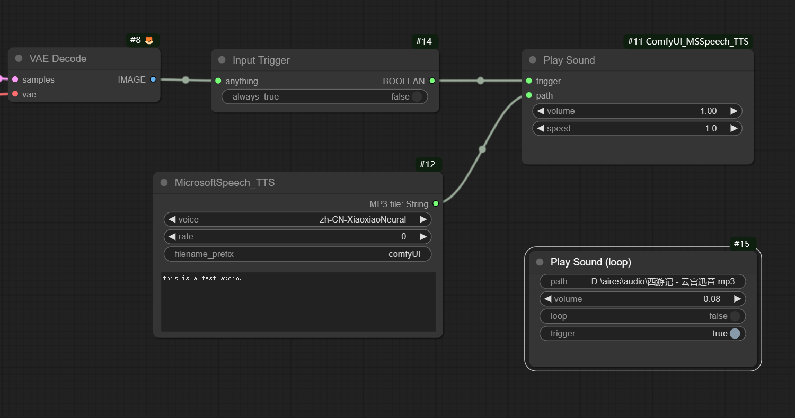

## 更新：
* MicrosoftSpeech_TTS节点上的语音列表可以通过修改voicelist.ini自定义。这个文件位于插件的根目录，包含全部可用语音选项并且默认屏蔽了一部分内容。用记事本或其他文本编辑软件打开这个文件，若想启用某个语音，删除这一行开头的“#”。对启用的语音进行屏蔽则在这行开头添加“#”。
* 语音列表改为更清晰的名称显示（语种语言+姓名+性别）

## 增加节点：
由于引入了新的节点，请重新安装依赖包。
### Play Sound 
可触发的声音播放节点，支持mp3和wav格式。这个节点支持多线程播放。  
选项说明：  
* path：声音文件路径。  
* volume：音量调整范围0-1.0。  
* speed：语速调整范围0.1-2.0。  
* trigger：触发开关，当其值为True时开始播放。
### Play Sound(loop)
可触发的声音播放节点，支持mp3和wav格式。这个节点始终占用一个声音播放线程。  
选项说明：  
* path：声音文件路径。  
* volume：音量调整范围0-1.0。  
* loop：当其值为True时循环播放，否则播放一次。  
* trigger：触发开关，当其值为True时开始播放。

### Input Trigger
输入触发器，可接入任意类型的数据，当检测到有输入内容（非None）时输出True；如果没有接入输入，将一直输出False。  
输入：任意类型，包括且不限于image, latent, model, clip, string, float, int等等。
输出：Boolean值。  
选项说明：  
* always_true：当此选项打开时，将忽略输入检测，直接输出True值；


# ComfyUI_MSSpeech_TTS  
ComfyUI下使用的文本转语音插件。使用Microsoft speech TTS 接口将文本内容转为MP3格式的语音文件。  


选项说明：   
* voice： 语音种类。   
* rate： 语音速度。默认是0，调整范围从-200到200。数字越大速度越快。  
* filename_prefix：文件名前缀。   

输出： 
MP3 File,字符串类型，其内容是语音文件地址。

## 使用示例：


## 安装方法：  
- 解压zip文件，将"ComfyUI_MSSpeech_TTS"文件夹复制到 ComfyUI\custom_nodes\
- 安装依赖包，在资源管理器ComfyUI\custom_nodes\ComfyUI_MSSpeech_TTS\ 这个位置打开cmd窗口，输入以下命令：  
```..\..\..\python_embeded\python.exe -s -m pip install -r requirements.txt```
- 重新打开ComfyUI
